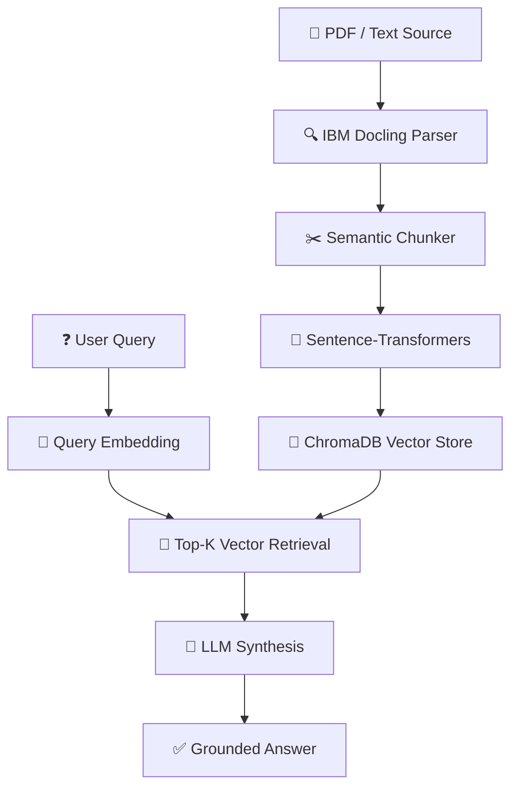

# Architecture Details: FinQuery RAG

This document provides a technical deep-dive into the **FinQuery AI** system, covering the data flow from ingestion to inference and the underlying component layers.

## 🏗️ System Overview

FinQuery follows a **Retrieval-Augmented Generation (RAG)** architecture, optimized for high-fidelity extraction from complex financial documents.

---

## 🛠️ Layered Component Breakdown

### 1. Ingestion Layer
Located in `app/rag/parser.py` and `app/rag/chunker.py`.
*   **Parser:** Uses **IBM Docling** to convert complex multi-column PDFs into structural Markdown. This is critical for capturing financial tables correctly.
*   **Chunking:** Employs **Semantic Chunking** and **Markdown Header Splitting** to ensure cohesive text segments are indexed together.
*   **Embeddings:** Powered by `sentence-transformers/all-MiniLM-L6-v2` for 384-dimensional semantic vectors.

### 2. Retrieval & Vector Engine
Located in `app/rag/vector_store.py`.
*   **ChromaDB:** A high-performance, local vector database storing embeddings and document metadata (`page_number`, `source_url`, `chunk_id`).
*   **Search Strategy:** Standard Cosine Similarity with a configurable **Similarity Threshold** to filter out low-confidence matches.

### 3. Synthesis (LLM) Layer
Located in `app/rag/generator.py`.
*   **Prompt Engineering:** Custom System Prompts specifically tuned for financial reasoning, ensuring math-heavy questions (like fee calculations) are handled precisely.
*   **Context Grounding:** The LLM is restricted to answer *only* from the provided context, preventing hallucinations.
*   **Providers:** Supports multiple backends via `.env`:
    *   **OpenAI:** GPT-4o-mini / GPT-4o.
    *   **Ollama:** Llama 3, Mistral, or Qwen (local).
    *   **Azure:** Enterprise-grade OpenAI deployments.

### 4. API & Application Layer
Located in `app/main.py` and `app/api/routes.py`.
*   **FastAPI:** Asynchronous backend providing RESTful endpoints for querying and document management.
*   **State Management:** Persistence via **PostgreSQL** (SQLAlchemy) or **MongoDB** (Motor), adapted for conversation logs and document history.

### 5. Frontend & UI Engine
Located in `app/templates/` and `app/static/`.
*   **Glassmorphic UI:** Modern "Onyx" design system with fluid CSS transitions and micro-animations.
*   **Theme Controller:** Client-side logic for Dark/Light mode switching with browser-level persistence.
*   **Real-time Feedback:** Integrated pipeline status animations and system health telemetry.

---

## 🔒 Security & Performance
*   **Local Inference:** Option to run entirely offline using Ollama, ensuring sensitive financial data never leaves the premises.
*   **Pydantic Validation:** Strict schema enforcement on all API payloads to prevent injection or malformed data.
*   **CORS Policies:** Configurable middleware for secure cross-origin communication.

---

## 🐳 Deployment Patterns
*   **Docker:** Portable images for deployment on **AWS ECS**, **GCP Cloud Run**, or local server clusters.
*   **Volumes:** Persistent storage mounts for ChromaDB collections to ensure data survives container restarts.
