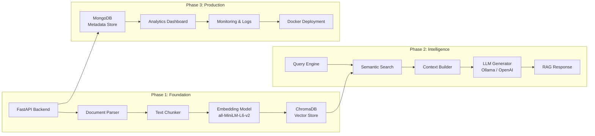
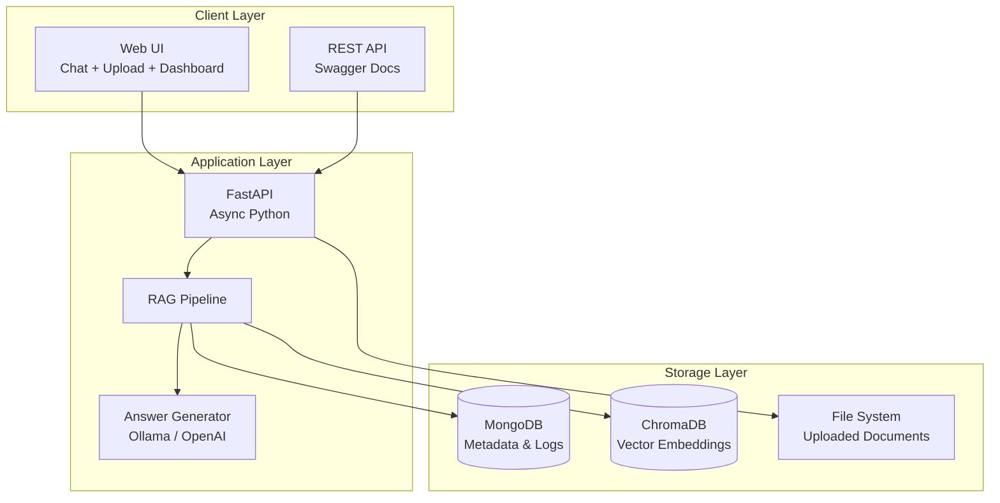

# HDFC RAG System — 3-Phase Implementation Structure

## System Architecture Overview



---

## Phase 1 — Foundation (Data Layer)

**Goal:** Build the core document ingestion pipeline — parse, chunk, embed, and store.

### Components

| Component | File | Purpose |
|---|---|---|
| FastAPI App | `app/main.py` | Application entry point, lifespan management |
| Config | `app/core/config.py` | Environment-based settings via Pydantic |
| Document Parser | `app/rag/parser.py` | Extract text from any file format |
| Text Chunker | `app/rag/chunker.py` | Split documents into overlapping chunks |
| Vector Store | `app/rag/vector_store.py` | Embed chunks + store in ChromaDB |
| Upload API | `app/api/routes.py` | `POST /api/documents/upload` |

### Supported Document Formats

| Format | Extension | Loader |
|---|---|---|
| PDF | `.pdf` | PyPDFLoader |
| Word | `.docx`, `.doc` | Docx2txtLoader |
| PowerPoint | `.pptx` | UnstructuredPowerPointLoader |
| Excel | `.xlsx`, `.xls` | UnstructuredExcelLoader |
| CSV | `.csv` | CSVLoader |
| JSON | `.json` | JSONLoader |
| HTML | `.html`, `.htm` | UnstructuredHTMLLoader |
| Markdown | `.md` | UnstructuredMarkdownLoader |
| Plain Text | `.txt` | TextLoader |

### Data Flow

```
User uploads file (any format)
        ↓
DocumentParser.parse() → extracts raw text per page/slide/sheet
        ↓
DocumentChunker.chunk_documents() → splits into ~512-char chunks with 50-char overlap
        ↓
VectorStoreManager.index_chunks() → generates 384-dim embeddings (all-MiniLM-L6-v2)
        ↓
ChromaDB.add_texts() → stores embeddings for cosine similarity search
```

### Key Design Decisions

- **Chunk size: 512 chars** — balances context window vs. retrieval precision
- **Overlap: 50 chars** — prevents information loss at chunk boundaries
- **Embedding model: all-MiniLM-L6-v2** — lightweight, fast, runs on CPU
- **ChromaDB** — local persistent vector store, no external dependencies

### Status: ✅ Complete

---

## Phase 2 — Intelligence (RAG Query Pipeline)

**Goal:** Build the retrieval-augmented generation pipeline — search, rank, generate answers.

### Components

| Component | File | Purpose |
|---|---|---|
| RAG Pipeline | `app/rag/pipeline.py` | Orchestrates the full query flow |
| Answer Generator | `app/rag/generator.py` | LLM-based answer synthesis |
| Query API | `app/api/routes.py` | `POST /api/query`, `GET /api/query/simple` |
| Response Models | `app/models/schemas.py` | Pydantic schemas for API I/O |

### Query Pipeline Flow

```
User asks a question
        ↓
Question → Embedding (same model as indexing)
        ↓
ChromaDB cosine similarity search → Top-K chunks retrieved
        ↓
Relevance threshold filter (default: 0.3)
        ↓
Context Builder → formats chunks into LLM prompt
        ↓
LLM generates grounded answer (Ollama qwen3.5:9b or OpenAI gpt-4o-mini)
        ↓
Response returned with: answer, source chunks, relevance scores, timing stats
```

### LLM Provider Support

| Provider | Config | Cost | Quality |
|---|---|---|---|
| **Ollama** (local) | `LLM_PROVIDER=ollama` | Free | Good (depends on model) |
| **OpenAI** (cloud) | `LLM_PROVIDER=openai` | ~$0.15/1M tokens | Excellent |

### Prompt Engineering

- **System prompt** — enforces HDFC Bank domain expertise, citation rules, ₹ formatting
- **Context injection** — retrieved chunks inserted as grounded context
- **Multi-turn support** — last 4 conversation messages prepended for follow-up questions
- **Fallback** — if LLM fails, raw retrieved context is shown to the user

### Key Design Decisions

- **Top-K = 5** — retrieves 5 most similar chunks per query
- **Threshold = 0.3** — filters out low-relevance noise
- **Temperature = 0.1** — deterministic, factual answers
- **Fallback mechanism** — graceful degradation when LLM is unavailable

### Status: ✅ Complete

---

## Phase 3 — Production (Persistence, Monitoring & Deployment)

**Goal:** Add durable metadata storage, observability, analytics, and containerized deployment.

### Components

| Component | File | Purpose |
|---|---|---|
| MongoDB Driver | `app/db/mongodb.py` | Async connection management (Motor) |
| Mongo Models | `app/db/mongo_models.py` | Pydantic schemas for document/chunk/query storage |
| PostgreSQL (alt) | `app/db/session.py` | Lazy-loaded SQLAlchemy (toggle via `DATABASE_TYPE`) |
| Health Check | `app/api/routes.py` | `GET /health` — monitors all subsystems |
| Statistics | `app/api/routes.py` | `GET /api/stats/` — aggregated metrics |
| Query Logs | `app/api/routes.py` | `GET /api/stats/recent-queries` |
| Web UI | `app/templates/` | Chat, Upload, Dashboard pages |
| Docker | `docker-compose.yml` | Full stack orchestration |

### MongoDB Collections

```
hdfc_rag database
├── documents        → Document metadata (title, filename, status, tags)
├── chunks           → Individual chunk content + metadata
├── query_logs       → Every query with timing, scores, retrieved chunks
└── conversations    → Multi-turn conversation history
```

### Architecture Diagram



### Monitoring & Health

The `/health` endpoint reports:

```json
{
  "status": "healthy",
  "postgres_connected": false,
  "mongodb_connected": true,
  "chroma_connected": true,
  "total_documents": 1,
  "total_chunks": 224,
  "embedding_model": "all-MiniLM-L6-v2",
  "llm_model": "qwen3.5:9b",
  "database_type": "mongodb"
}
```

### Deployment Options

| Method | Command | Best For |
|---|---|---|
| **Local (dev)** | `./venv/bin/python -m uvicorn app.main:app --reload` | Development |
| **Local (prod)** | `TOKENIZERS_PARALLELISM=false ./venv/bin/python -m uvicorn app.main:app` | Stable local use |
| **Docker** | `docker-compose up -d` | Production deployment |

### Key Design Decisions

- **MongoDB as primary store** — flexible schema for diverse document metadata
- **PostgreSQL as optional** — toggle via `DATABASE_TYPE` for SQL-first teams
- **Lazy database initialization** — app starts even if PostgreSQL is unavailable
- **Non-fatal MongoDB connection** — warns on startup failure, retries on first request
- **Structured logging** — `structlog` with JSON output for log aggregation

### Status: ✅ Complete

---

## Technology Stack Summary

| Layer | Technology | Version |
|---|---|---|
| **Web Framework** | FastAPI | 0.115.x |
| **LLM (Local)** | Ollama + qwen3.5:9b | Latest |
| **LLM (Cloud)** | OpenAI gpt-4o-mini | Latest |
| **Embeddings** | all-MiniLM-L6-v2 | 384-dim |
| **Vector DB** | ChromaDB | 0.5.x |
| **Metadata DB** | MongoDB | 7.0 |
| **Async Driver** | Motor | 3.6.x |
| **ORM (optional)** | SQLAlchemy | 2.0.x |
| **Document Parsing** | LangChain + Unstructured | 0.3.x |
| **Logging** | structlog | 24.x |
| **Deployment** | Docker Compose | Latest |

---

## File Structure

```
hdfc-rag/
├── app/
│   ├── main.py                 # FastAPI entry point + lifespan
│   ├── core/
│   │   └── config.py           # Pydantic settings from .env
│   ├── api/
│   │   └── routes.py           # All REST endpoints
│   ├── db/
│   │   ├── mongodb.py          # Motor async connection (Phase 3)
│   │   ├── mongo_models.py     # MongoDB Pydantic schemas (Phase 3)
│   │   ├── models.py           # SQLAlchemy models (optional)
│   │   └── session.py          # Lazy PostgreSQL engine (optional)
│   ├── rag/
│   │   ├── pipeline.py         # Core RAG orchestrator
│   │   ├── parser.py           # Universal document parser (Phase 1)
│   │   ├── chunker.py          # Text splitting (Phase 1)
│   │   ├── vector_store.py     # ChromaDB manager (Phase 1)
│   │   └── generator.py        # LLM answer generation (Phase 2)
│   ├── models/
│   │   └── schemas.py          # API request/response models
│   ├── templates/              # Jinja2 HTML templates
│   └── static/                 # CSS, JS, images
├── data/
│   ├── chroma_db/              # ChromaDB persistent storage
│   └── uploads/                # Uploaded document files
├── .env                        # Environment configuration
├── requirements.txt            # Python dependencies
├── docker-compose.yml          # Docker orchestration
└── usage_guide.md              # User documentation
```
