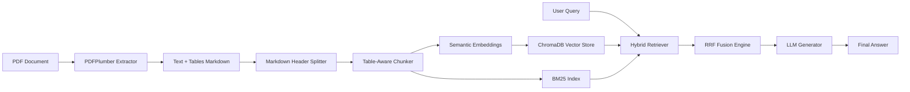
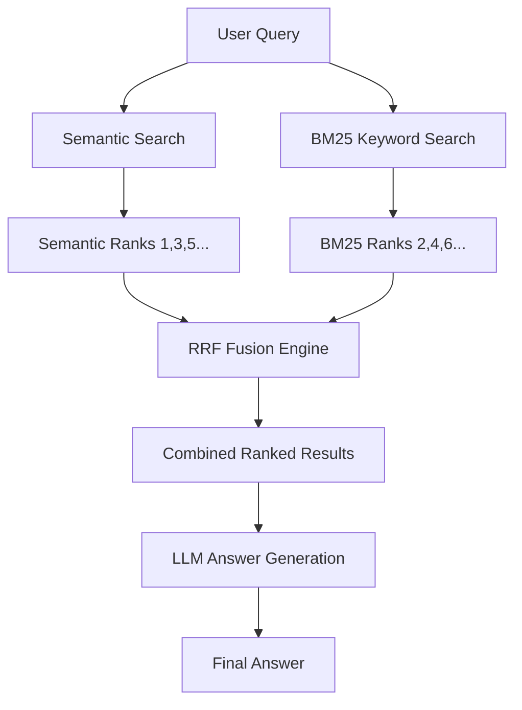

# Minimal RAG System

Working minimal RAG implementation that supports:
✅ Ollama (local LLMs)
✅ Azure OpenAI
✅ Standard OpenAI
✅ Document-aware chunking with LangChain RecursiveCharacterTextSplitter
✅ Modern LangChain packages (no deprecation warnings)

## Setup

1. Install dependencies:
```bash
pip install -r requirements.txt
```

2. Configure in `.env`:
   - For Ollama: `LLM_PROVIDER=ollama` and `LLM_MODEL=llama3.2`
     - First install Ollama: https://ollama.ai/download
     - Then run: `ollama pull llama3.2`
   - For Azure OpenAI: set `LLM_PROVIDER=azure` and add your Azure credentials
   - For OpenAI: `LLM_PROVIDER=openai` and set `OPENAI_API_KEY`

## Run Example Script
```bash
cd minimal-rag
PYTHONPATH=/Users/pankajshakya/Downloads/hdfc-rag/minimal-rag python example.py
```

## Run Streamlit Web UI
```bash
cd minimal-rag
PYTHONPATH=/Users/pankajshakya/Downloads/hdfc-rag/minimal-rag streamlit run app.py
```

This will open a web interface where you can:
- Upload PDF documents
- Ask questions about uploaded documents
- See current configuration status

## Key Technologies

- **LangChain**: RAG orchestration
- **langchain-huggingface**: Modern embeddings (HuggingFaceEmbeddings)
- **langchain-ollama**: Modern Ollama integration (ChatOllama)
- **langchain-chroma**: Vector storage
- **RecursiveCharacterTextSplitter**: Document-aware chunking
- **Streamlit**: Web interface
- **PyPDFLoader/TextLoader**: Document ingestion

## Project Structure
```
minimal-rag/
├── rag_module/
│   ├── __init__.py
│   ├── config.py
│   └── rag.py       # Core RAG with semantic chunking
├── app.py           # Streamlit web UI
├── example.py
├── requirements.txt
├── .env
└── README.md
```

## Usage
```python
from rag_module.rag import MinimalRAG

rag = MinimalRAG()
rag.add_document("Your document text here")
answer = rag.query("Your question here")
```

---

## 🧠 RAG Architecture Deep Dive

### 📊 Full Pipeline Architecture


### 📄 Document Processing Pipeline
The system uses a **table-aware document processing pipeline** optimized for financial documents like credit card policies:

#### 1. **PDF Extraction (PDFPlumber)**
- Uses **pdfplumber** instead of standard PyPDFLoader
- Extracts text with layout preservation
- **Automatic table detection**: Detects tables in PDFs and converts them to proper Markdown format
- Each table becomes searchable Markdown with headers, separators, and rows
- Preserves page numbers and document structure

#### 2. **Table-Aware Chunking Strategy**
Instead of arbitrary character-based splitting:
```
┌───────────────────────────────────────────────────┐
│  Document → Header Split → Table-aware Split      │
└───────────────────────────────────────────────────┘
```

**Split order (highest priority first):**
1.  `\n\n---\n\n` - **Table separator** (never split tables)
2.  `##` - H2 headers (major sections)
3.  `#` - H1 headers (document sections)
4.  `\n\n\n` - Triple newlines (major breaks)
5.  `\n\n` - Double newlines (paragraphs)
6.  Sentence boundaries `(?<=\.)\s+`
7.  Word boundaries

**Chunk settings:**
- Size: 1500 characters
- Overlap: 200 characters
- Enriched metadata: `has_table`, `page_number`, `char_count`

---

### 🔍 Hybrid Retrieval Strategy



Combines **two complementary retrieval methods** using **Reciprocal Rank Fusion (RRF)**:

#### 1. Semantic Search (Vector)
- **Model**: all-MiniLM-L6-v2 (384d embeddings)
- **Storage**: ChromaDB with cosine similarity
- **Strength**: Finds conceptually similar content, understands context
- **Weakness**: Fails at exact keyword/table matches

#### 2. BM25 Keyword Search
- **Library**: rank_bm25
- **Strength**: Excellent at exact term matches, table headers, card names
- **Weakness**: Fails at semantic understanding, synonyms

### Why This Architecture Is Better:
| Strategy | Table Retrieval | Card Names | Context Understanding |
|----------|-----------------|-------------|------------------------|
| Standard Semantic | ❌ Poor | ❌ Poor | ✅ Excellent |
| Standard BM25 | ✅ Excellent | ✅ Excellent | ❌ Poor |
| **Hybrid RRF** | ✅ Excellent | ✅ Excellent | ✅ Excellent |

#### 3. RRF Fusion Formula
```
Score(document) = (0.5 × 1/(60 + semantic_rank)) + (0.5 × 1/(60 + bm25_rank))
```

- Equal weight (50/50) for both methods
- `k=60` standard RRF parameter
- Documents ranked by combined score
- Best of both worlds: Semantic + Exact keyword matching

## 📦 Complete Component Inventory

| Component | Technology | Version | Purpose |
|-----------|------------|---------|---------|
| **PDF Extractor** | PDFPlumber | 0.11.9 | High-fidelity text + table extraction |
| **Chunking** | RecursiveCharacterTextSplitter | 0.3.4 | Table-aware semantic splitting |
| **Embeddings** | all-MiniLM-L6-v2 | 3.3.1 | 384d semantic embeddings |
| **Vector Store** | ChromaDB | 0.5.23 | Local persistent storage |
| **Keyword Search** | rank-bm25 | 0.2.2 | Okapi BM25 search |
| **Retrieval Fusion** | Reciprocal Rank Fusion | -- | Hybrid search |
| **LLM Integration** | langchain-ollama | 0.2.1 | Ollama / Azure / OpenAI |
| **Web UI** | Streamlit | 1.36.0 | Document upload & query |

---

## ⚙️ Key Configuration Parameters

| Parameter | Value | Description |
|-----------|-------|-------------|
| `CHUNK_SIZE` | 1500 chars | Maximum chunk size |
| `CHUNK_OVERLAP` | 200 chars | Context overlap between chunks |
| `TOP_K_RESULTS` | 8 | Documents returned per query |
| `RRF_K` | 60 | Rank fusion tuning parameter |
| `VECTOR_WEIGHT` | 0.5 | Semantic search weight |
| `BM25_WEIGHT` | 0.5 | Keyword search weight |

---

## 🔬 Core Concepts Implemented

### 1. BM25Retriever (from hybrid_retriever.py)
**Implementation**: Plain Python class, not Pydantic model, for full flexibility
```python
class BM25Retriever:
    def __init__(self, documents: List[Document], k: int = 4):
        # Tokenizes all documents
        # Initializes BM25Plus index
        # No external dependencies beyond rank-bm25
```
**Key features**:
- Handles empty document cases gracefully
- Lowercase tokenization for better matching
- Returns only documents with positive BM25 scores
- Fast in-memory keyword search

---

### 2. HybridRetriever with RRF Fusion (from hybrid_retriever.py)
**RRF Formula Implemented**:
```python
Score(document) = (vector_weight × 1/(rrf_k + semantic_rank)) + 
                 (bm25_weight × 1/(rrf_k + bm25_rank))
```

**Code behavior**:
- Retrieves from both semantic and BM25 in parallel
- Uses first 200 characters of page content as stable document ID
- Handles duplicate documents across both retrievers
- Falls back to BM25 only if fusion returns no results
- Equal 50/50 weighting balanced for financial documents

---

### 3. Table-Aware Chunking (from rag.py)
**Splitter priority order**:
```python
separators=[
    r"\n\n---\n\n",     # 1. NEVER SPLIT TABLES
    r"\n\n## ",         # 2. H2 headers
    r"\n\n# ",          # 3. H1 headers  
    r"\n\n\n",          # 4. Major section breaks
    r"\n\n",            # 5. Paragraphs
    r"\n",              # 6. Lines
    r"(?<=\.)\s+",      # 7. Sentences
    r" ",               # 8. Words
]
```

**Critical guarantee**:
> *Markdown tables separated by `---` will **never** be split across chunks. Entire tables stay together for complete context.*

---

### 4. PDF Table Extraction (from rag.py)
**PDFPlumber workflow**:
```python
1. Open PDF with pdfplumber
2. Extract text with layout preservation
3. Detect tables using pdfplumber table detection
4. Convert each table to valid Markdown format
5. Append tables to page content with "## Tables on Page X"
6. Pass combined text + tables to chunker
```

**Result**: Tables become searchable Markdown that LLM can parse correctly

---
- **Tables are preserved as complete Markdown blocks** (never split across chunks)
- **BM25 finds exact card names** like "Times Platinum"
- **Semantic search understands context** like "fees", "charges", "benefits"
- **RRF combines both** to surface the most relevant tables

**Example Query Flow:**
> "What are the fees for Times Platinum Credit Card?"
> 1. BM25 finds chunks containing "Times", "Platinum", "fees"
> 2. Semantic search finds chunks about credit card charges
> 3. RRF ranks the actual fee table as #1 result
> 4. LLM receives complete table context
