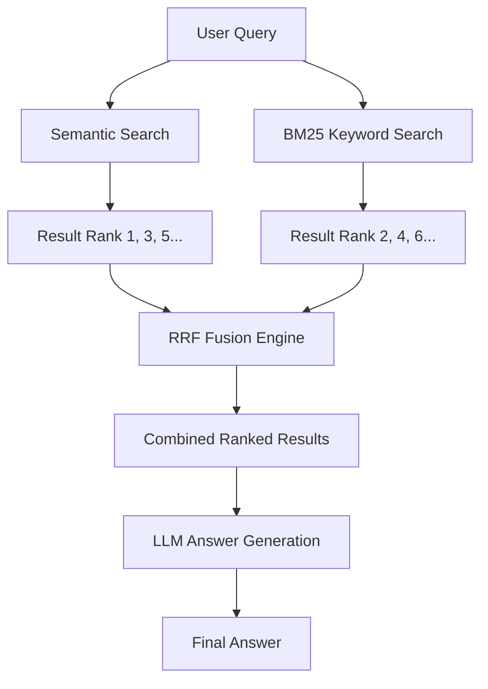

# Minimal RAG System

Working minimal RAG implementation that supports:
✅ Ollama (local LLMs)
✅ Azure OpenAI
✅ Standard OpenAI
✅ Document-aware chunking with LangChain RecursiveCharacterTextSplitter
✅ Modern LangChain packages (no deprecation warnings)

## Setup

1. Install dependencies:
```bash
pip install -r requirements.txt
```

2. Configure in `.env`:
   - For Ollama: `LLM_PROVIDER=ollama` and `LLM_MODEL=llama3.2`
     - First install Ollama: https://ollama.ai/download
     - Then run: `ollama pull llama3.2`
   - For Azure OpenAI: set `LLM_PROVIDER=azure` and add your Azure credentials
   - For OpenAI: `LLM_PROVIDER=openai` and set `OPENAI_API_KEY`

## Run Example Script
```bash
cd minimal-rag
PYTHONPATH=/Users/pankajshakya/Downloads/hdfc-rag/minimal-rag python example.py
```

## Run Streamlit Web UI
```bash
cd minimal-rag
PYTHONPATH=/Users/pankajshakya/Downloads/hdfc-rag/minimal-rag streamlit run app.py
```

This will open a web interface where you can:
- Upload PDF documents
- Ask questions about uploaded documents
- See current configuration status

## Key Technologies

- **LangChain**: RAG orchestration
- **langchain-huggingface**: Modern embeddings (HuggingFaceEmbeddings)
- **langchain-ollama**: Modern Ollama integration (ChatOllama)
- **langchain-chroma**: Vector storage
- **RecursiveCharacterTextSplitter**: Document-aware chunking
- **Streamlit**: Web interface
- **PyPDFLoader/TextLoader**: Document ingestion

## Project Structure
```
minimal-rag/
├── rag_module/
│   ├── __init__.py
│   ├── config.py
│   └── rag.py       # Core RAG with semantic chunking
├── app.py           # Streamlit web UI
├── example.py
├── requirements.txt
├── .env
└── README.md
```

## Usage
```python
from rag_module.rag import MinimalRAG

rag = MinimalRAG()
rag.add_document("Your document text here")
answer = rag.query("Your question here")
```

---

## 🧠 RAG Architecture Deep Dive

### 📊 Full Pipeline Architecture
```mermaid
flowchart LR
    A[PDF Document] --> B[PDFPlumber Extractor]
    B --> C[Text + Tables (Markdown)]
    C --> D[Markdown Header Splitter]
    D --> E[Table-Aware Chunker]
    E --> F[Semantic Embeddings]
    E --> G[BM25 Index]
    F --> H[ChromaDB Vector Store]
    
    I[User Query] --> J[Hybrid Retriever]
    H --> J
    G --> J
    J --> K[RRF Fusion]
    K --> L[LLM Generator]
    L --> M[Answer]
```

### 📄 Document Processing Pipeline
The system uses a **table-aware document processing pipeline** optimized for financial documents like credit card policies:

#### 1. **PDF Extraction (PDFPlumber)**
- Uses **pdfplumber** instead of standard PyPDFLoader
- Extracts text with layout preservation
- **Automatic table detection**: Detects tables in PDFs and converts them to proper Markdown format
- Each table becomes searchable Markdown with headers, separators, and rows
- Preserves page numbers and document structure

#### 2. **Table-Aware Chunking Strategy**
Instead of arbitrary character-based splitting:
```
┌───────────────────────────────────────────────────┐
│  Document → Header Split → Table-aware Split      │
└───────────────────────────────────────────────────┘
```

**Split order (highest priority first):**
1.  `\n\n---\n\n` - **Table separator** (never split tables)
2.  `##` - H2 headers (major sections)
3.  `#` - H1 headers (document sections)
4.  `\n\n\n` - Triple newlines (major breaks)
5.  `\n\n` - Double newlines (paragraphs)
6.  Sentence boundaries `(?<=\.)\s+`
7.  Word boundaries

**Chunk settings:**
- Size: 1500 characters
- Overlap: 200 characters
- Enriched metadata: `has_table`, `page_number`, `char_count`

---

### 🔍 Hybrid Retrieval Strategy



Combines **two complementary retrieval methods** using **Reciprocal Rank Fusion (RRF)**:

#### 1. Semantic Search (Vector)
- **Model**: all-MiniLM-L6-v2 (384d embeddings)
- **Storage**: ChromaDB with cosine similarity
- **Strength**: Finds conceptually similar content, understands context
- **Weakness**: Fails at exact keyword/table matches

#### 2. BM25 Keyword Search
- **Library**: rank_bm25
- **Strength**: Excellent at exact term matches, table headers, card names
- **Weakness**: Fails at semantic understanding, synonyms

### Why This Architecture Is Better:
| Strategy | Table Retrieval | Card Names | Context Understanding |
|----------|-----------------|-------------|------------------------|
| Standard Semantic | ❌ Poor | ❌ Poor | ✅ Excellent |
| Standard BM25 | ✅ Excellent | ✅ Excellent | ❌ Poor |
| **Hybrid RRF** | ✅ Excellent | ✅ Excellent | ✅ Excellent |

#### 3. RRF Fusion Formula
```
Score(document) = (0.5 × 1/(60 + semantic_rank)) + (0.5 × 1/(60 + bm25_rank))
```

- Equal weight (50/50) for both methods
- `k=60` standard RRF parameter
- Documents ranked by combined score
- Best of both worlds: Semantic + Exact keyword matching

---

## ✅ Why This Works For Tables
- **Tables are preserved as complete Markdown blocks** (never split across chunks)
- **BM25 finds exact card names** like "Times Platinum"
- **Semantic search understands context** like "fees", "charges", "benefits"
- **RRF combines both** to surface the most relevant tables

**Example Query Flow:**
> "What are the fees for Times Platinum Credit Card?"
> 1. BM25 finds chunks containing "Times", "Platinum", "fees"
> 2. Semantic search finds chunks about credit card charges
> 3. RRF ranks the actual fee table as #1 result
> 4. LLM receives complete table context
